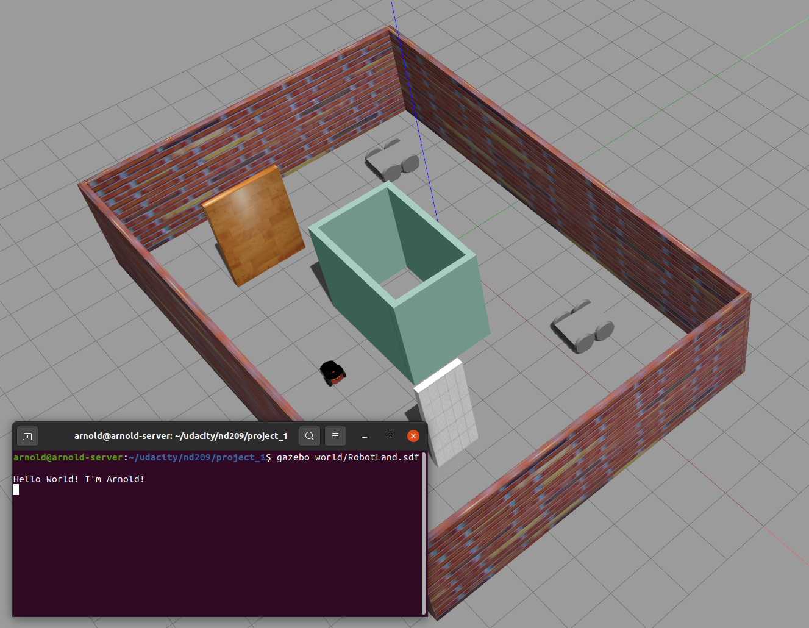

# Project 1: Build My World
Project #1 for the Robotics Software Engineer Nanodegree Program. 

Tasks:

1. Build a single floor wall structure using the Building Editor tool in Gazebo. 
2. Model any object of your choice using the Model Editor tool in Gazebo. 
3. Create an empty Gazebo World and import a Building and  your model
4. Import at least one model from the Gazebo online library 
5. Write a C++ World Plugin


### Directory Structure
```
    .myrobot                           # myrobot lab main folder 
    ├── images                         # Code output image                   
    │   ├── output.png
    ├── model                          
    │   ├── arnold                     # Model files of the two-wheeled robot
    │   ├── Building                   # Model files of the Building
    │   ├── chassis                    # Model files of the 4-wheeled robot
    ├── script                         # Gazebo World plugin C++ script      
    │   ├── hello.cpp
    ├── world                          # Gazebo main World empty scene
    │   ├── RobotLand.sdf
    ├── CMakeLists.txt                 # Link libraries 
    └── README.md                             
```

### Steps to launch the simulation

#### Step 1 Update and upgrade the Workspace image
```sh
$ sudo apt-get update
$ sudo apt-get upgrade -y
```

#### Step 2 Clone the lab folder in /home/workspace/
```sh
$ mkdir -p ~/udacity/nd209/
$ cd ~/udacity/nd209/
$ git clone https://github.com/mnrozhkov/udacity-nd209-project1.git project_1
```

#### Step 3 Compile the code
```sh
$ cd ~/udacity/nd209/project_1
$ mkdir build
$ cd build/
$ cmake ../
$ make
```

#### Step 4 Add the library path to the Gazebo plugin path  
```sh
$ export GAZEBO_PLUGIN_PATH=${GAZEBO_PLUGIN_PATH}:/~/udacity/nd209/project_1/build
```

#### Step 5 Run the Gazebo World file  
```sh
$ cd ~/udacity/nd209/project_1/world/
$ gazebo RobotLand.sdf
```

### Output
The hello world message and the two-wheeled robot inside a Gazebo World should both launch as follow: 

    
 
